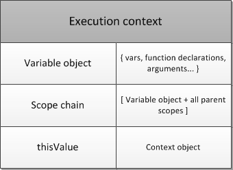
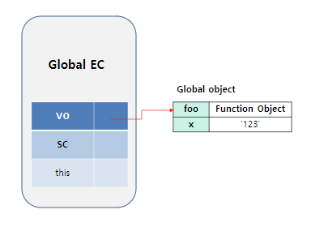
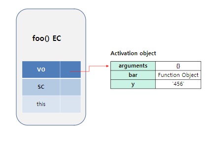
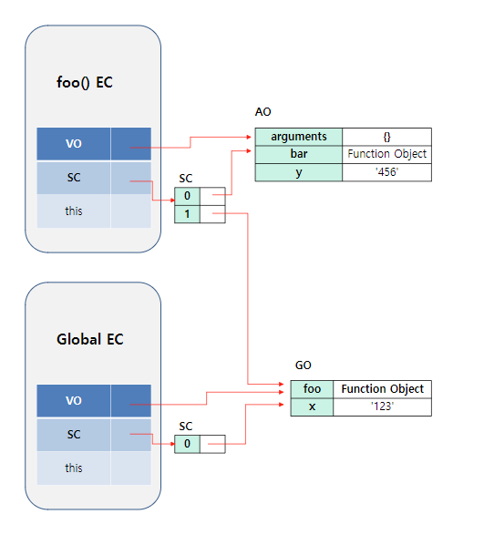
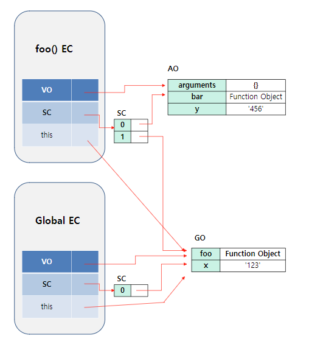
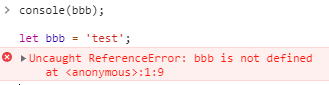

---
 * 티스토리 블로그에서 포스팅한 내용을 옮겨왔습니다.
---

# Execution context
* 해당 내용은 ECMAScript3 를 기준으로 하며, ES5 부터는 lexical environment 로 변경되었고, ES6 들어서도 내용이 좀 변화하였습니다.
* 그러나 해당 내용은 기본적이며, 본질은 비슷하기에, execution context 만 정리하도록 하겠습니다.
 
 
---
 

## 1. Execution context란?
* Execution context란(이하 EC), 쉽게 말해 JS 엔진에서 함수를 어떤 식으로 읽어들여서 수행할 것인지에 대한 정보들을 담고 있는 것이라고 할 수 있습니다.
* 예를 들어, foo 라는 함수를 호출하면, js 엔진에서는 foo 에 대한 여러 정보들을 알고 있어야 실행할 수 있습니다.
* 일반적으로 추상화된 개념이라고는 하지만, 내부적으로는 개체 형태로 정보들을 담고 있다고 합니다.
* 이러한 EC 는 수행 시 **Execution context stack** 이라는 스택에 쌓이며 내용이 처리됩니다.
  * 함수 호출 시, 함수에 대한 EC 가 생성되며, EC Stack 에 쌓이고 제어권이 넘어가게 됩니다.
  

[ Execution context stack ]

 
 

## 2. Execution context의 구조

[ Execution context 구조 ]

* Execution context는 크게 3가지 정보를 담고 있습니다.
  * 변수와 내부 함수들의 정보 (매개변수, 인수 정보 등)
  * 변수의 유효 범위 (scope)
  * this 바인딩 (this value)
* 이런 정보들은 위 그림과 같이 Variable Object, Scope chain, thisValue 를 통해 값을 담고 있습니다.
 
 

### Variable Object

[ Global Execution context 의 GO ]

[ foo() Execution context - AO ]

* Variable Object (이하 VO)는 변수들에 대한 정보, 내부 함수 객체에 대한 정보 등을 담고 있는 객체를 가리킵니다.
  * 직접 담고 있는게 아니라, 해당 정보를 담고 있는 객체의 주소를 가지고 있습니다. (포인터!)
* 이러한 정보를 담고 있는 객체는 전역코드를 수행할 때와 일반 함수 호출에 의해 함수에 대한 execution context를 생성했을 때 명칭이 약간 다릅니다.
* 전역 코드를 수행하려고 execution context를 생성하면, 이때 변수 정보들과 함수 객체 정보들을 담고 있는 객체를 Global Object(줄여서 GO)라고 부릅니다.
* 일반 함수를 호출했을 때에는 Activation Object(줄여서 AO)라고 부릅니다.
* GO와 AO는 거의 같으나, AO 같은 경우 함수 호출에 의해 생성되었으므로 매개변수와 arguments 정보를 추가로 담고 있습니다.
 
 

### Scope Chain

[ Scope chain ]

* Scope chain 은 리스트 형태를 가지고 있으며, 자신과 자신의 상위에 대한 VO의 주소를 담고 있습니다.
* 리스트의 제일 마지막은 전역 객체인 GO에 대한 주소를 담고 있습니다.
* 이를 통해 자신에게 없는 변수는 scope chain을 통해 자신의 상위 VO에서 변수를 검색하며, 최종적으로는 GO에서 변수를 검색하고 없으면 에러를 발생시킵니다.
  * 즉, **변수를 찾는 메커니즘은 scope chain 에 의해 이루어진다고 볼 수 있습니다.**
  * 여기서 주의할 점은 객체의 property를 찾는 것은 아닙니다.
  * 객체의 property 를 찾는 메커니즘은 정확히는 **prototype chain**에 의해서 검색하게 됩니다.
 
 

### thisValue

[ thisValue ]

* this 값이 할당됩니다.
* 여기서 this는 이전 포스팅에도 언급했지만, 함수 호출 패턴에 의해 결정되며, 최초 들어있는 값은 GO 의 주소를 담고 있습니다.
 
 

## 3. Execution context 생성 과정

* 생성과정은 정말 길지만, 아래에선 간단히만 설명하도록 하겠습니다.
* 자세하게 알고 싶으신 분들은 [실행 컨텍스트와 자바스크립트의 동작 원리](https://poiemaweb.com/js-execution-context) 를 읽어보시면 도움이 될것이라 생각합니다.

### 전역 객체(GO) 생성
* 우선 전역 코드로 돌입하기 전에, 유일한 전역 객체인 GO가 생성됩니다.
* 전역 코드 실행 시 Global EC 가 생성이 되고, execution context stack 에 쌓이게 됩니다.
* 이후 3가지 과정에 의해서 값을 채우게 되는데, 이 순서는 항상 일정합니다.
  1. Scope chain 의 생성과 초기화
  2. Variable Instantiation(변수 객체화) 실행 -> 변수의 선언, 초기화, 할당
  3. this value 결정

### 변수 객체화
* 변수 객체화는 아래의 순서로 실행하며, 반드시 순서대로 실행됩니다.
1. (Function code 인 경우) 매개변수가 AO의 프로퍼티로, argument 가 값으로 설정됨
2. 대상 코드 내의 **함수 선언**(함수 표현식 제외)을 대상으로 함수명이 property로 세팅하며, 함수 객체가 값으로 설정됨(**이 과정이 함수 호이 스팅의 원리임!**)
3. 대상 코드 내의 변수 선언을 대상으로 변수명이 GO / AO 의 property로 세팅하며, 값은 undefined 가 세팅됩니다. 이 과정을 좀 더 세분화 하면 3단계로 이루어집니다.
   1. 변수 선언 단계 - GO / AO에 변수가 등록됨
   2. 변수 초기화 단계 - 변수 값을 메모리에 할당함. 이 단계에서 변수는 undefined 로 초기화됨
   3. 변수 할당 단계 - 실제 코드 수행에 돌입해서 해당 라인을 만나면, 실제 변수 값을 세팅하게 됨.
* 위 과정 중, 3.1 과 3.2 가 한 번에 이루어집니다.
* 따라서 변수 선언 이전에 변수에 접근해도, GO / AO 에 변수가 등록되어 있기 때문에 에러가 발생하지 않습니다.
* 이러한 현상이 마치 변수가 코드 중간 부분에 선언되어도, 최상단으로 끌어올려지는 것처럼 보입니다. 이것이 "**호이스팅의 원리**"입니다.
* 여담으로 ES6의 let 은 위의 3.1 과 3.2 단계가 따로 이루어집니다. 따라서 변수 선언 이전에 참조하면 에러를 발생시킵니다.

[ let 의 변수 선언 이전 참조 시 오류 ]

### 실행
* 위 과정이 끝나면, 이제 본격적으로 코드를 한줄씩 수행하며 실행하게 됩니다.
* 실행이 마무리 되면, 해당 execution context 는 stack 에서 빠져나오고 소멸하게 됩니다.

### 클로져

[ bar 함수 주목! ]

* 위의 bar 와 같은 내부 함수 같은 경우, 내부적으로 [[Scopes]] 라는 프로퍼티를 소유하고 있습니다.
* 이 프로퍼티는 함수 객체가 실행되는 환경을 가리킵니다.
  * 좀 더 정확히는 자신을 소유하고 있는 execution context 의 scope chain 리스트를 가리키는 주소를 담고 있습니다.
  * 예를 들어, GO 에 담겨 있는 foo 함수 객체의 [[Scopes]] 에는 Global EC 의 scope chain 리스트의 주소를 담고 있으며,
  * bar 함수 객체의 [[Scopes]] 에는 foo() Execution context 의 scope chain 리스트의 주소를 담고 있습니다.
* 여기서 내부함수 bar가 유효한 상태(내부함수를 리턴으로 반환했다던가..)에서 외부 함수인 foo 함수가 종료되어 외부함수의 execution context가 반환되었다고 할때,
  * 외부 함수 foo 의 execution context 은 execution context stack 에서 빠져나오고 제거되나, foo 의 AO 는 메모리 참조가 bar 의 [[Scopes]] 로 참조되고 있기 때문에 여전히 유효한 상태로 메모리에 살아있게 됩니다.
  * 여기서 bar 함수를 수행했을 때, bar 함수는 자신의 [[Scopes]] 프로퍼티를 통해 foo 의 scope chain list 에 접근하고, 여기서 foo 의 AO 에 접근할 수 있습니다.
  * 그리고 결과적으로 bar 함수는 foo 함수의 변수에 접근을 할 수 있는 것이죠.
* 이러한 동작을 **클로저(Closure)** 라 부릅니다.
  * 자세한 내용은 따로 포스팅을 해보도록 하겠습니다.