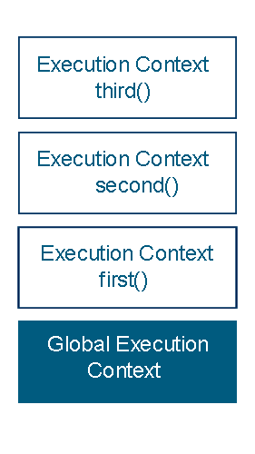

---
 * 티스토리 블로그에서 포스팅한 내용을 옮겨왔습니다.
---

# Execution context
* 해당 내용은 ECMAScript3 를 기준으로 하며, ES5 부터는 lexical environment 로 변경되었고, ES6 들어서도 내용이 좀 변화하였습니다.
* 그러나 해당 내용은 기본적이며, 본질은 비슷하기에, execution context 만 정리하도록 하겠습니다.
 
 
---
 

## 1. Execution context란?
* Execution context란(이하 EC), 쉽게 말해 JS 엔진에서 함수를 어떤 식으로 읽어들여서 수행할 것인지에 대한 정보들을 담고 있는 것이라고 할 수 있습니다.
* 예를 들어, foo 라는 함수를 호출하면, js 엔진에서는 foo 에 대한 여러 정보들을 알고 있어야 실행할 수 있습니다.
* 일반적으로 추상화된 개념이라고는 하지만, 내부적으로는 개체 형태로 정보들을 담고 있다고 합니다.
* 이러한 EC 는 수행 시 **Execution context stack** 이라는 스택에 쌓이며 내용이 처리됩니다.
  * 함수 호출 시, 함수에 대한 EC 가 생성되며, EC Stack 에 쌓이고 제어권이 넘어가게 됩니다.
  

[ Execution context stack ]

## 2. Execution context의 구조